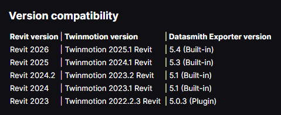

# TwinmotionForAnyRevit
Windows Batch file to set registry values for the latest installed version of `Twinmotion For Revit` as the active version for Revit 2023+.
## Inspiration
This batch file was created as a way to ensure that the `Open With Twinmotion` feature in Revit releases works as expected with whichever version of `Twinmotion for Revit` is installed.  
  
**`Issue:`** Revit has hardcoded checks for specific releases of Twinmotion for Revit.  
  
**`Solution:`** Trick Revit by modifying the registry to make sure it thinks the appropriate version is installed and modify where it looks to launch it.  

## How to use it  
Download and run the bat file.  
###### NOTES
:warning: It is recommended that you have your local IT expert review and determine the best approach to deploy. :warning:  
:warning: The Registry Keys are `Current User` keys so it may have to be run for all users on a machine if the resource is shared. :warning:
  
## How it works  
###### Find Twinmotion for Revit Installs and get the path for the newest release
```bat
echo Finding newest Twinmotion folder...
for /f "delims=" %%a in ('powershell -Command "Get-ChildItem -Path 'C:\Program Files\Epic Games' -Directory | Where-Object { $_.Name -like '*Twinmotion*' } | Sort-Object -Descending | Select-Object -First 1 -ExpandProperty Name"') do (
    set "folderName=%%a"
)
echo Found folder: %folderName%
```
###### Extract the year from the path as the EXE name and location has changed between releases
```bat
set "versionPart="
for /f "tokens=2 delims= " %%a in ("%folderName%") do set "versionPart=%%a"
for /f "tokens=1 delims=-" %%a in ("%versionPart%") do set "yearPart=%%a"
set "year=%yearPart:~0,4%"
```
###### Set the path to the EXE based on the release year
```bat
if %year% LEQ 2023 (
    set "fullPath=C:\Program Files\Epic Games\%folderName%\Twinmotion.exe"
) else (
    set "fullPath=C:\Program Files\Epic Games\%folderName%\Twinmotion\Binaries\Win64\TwinmotionCookedEditor-Win64-Shipping.exe"
)
```
###### Tell Revit that the release is installed
```bat
reg add "HKCU\Software\Microsoft\Twinmotion 2022.2-Revit" /v "Installed" /t REG_DWORD /d 1 /f
reg add "HKCU\Software\Microsoft\Twinmotion 2023.1-Revit" /v "Installed" /t REG_DWORD /d 1 /f
reg add "HKCU\Software\Microsoft\Twinmotion 2023.2-Revit" /v "Installed" /t REG_DWORD /d 1 /f
reg add "HKCU\Software\Microsoft\Twinmotion 2024.1-Revit" /v "Installed" /t REG_DWORD /d 1 /f
reg add "HKCU\Software\Microsoft\Twinmotion 2025.1-Revit" /v "Installed" /t REG_DWORD /d 1 /f
```
###### Set the EXE path for all releases to the newest installed version
```bat
reg add "HKCU\Software\Microsoft\Windows\CurrentVersion\App Paths\Twinmotion2022.2-Revit.exe" /v "" /t REG_SZ /d "%fullPath%" /f
reg add "HKCU\Software\Microsoft\Windows\CurrentVersion\App Paths\Twinmotion2023.1-Revit.exe" /v "" /t REG_SZ /d "%fullPath%" /f
reg add "HKCU\Software\Microsoft\Windows\CurrentVersion\App Paths\Twinmotion2023.2-Revit.exe" /v "" /t REG_SZ /d "%fullPath%" /f
reg add "HKCU\Software\Microsoft\Windows\CurrentVersion\App Paths\Twinmotion2024.1-Revit.exe" /v "" /t REG_SZ /d "%fullPath%" /f
reg add "HKCU\Software\Microsoft\Windows\CurrentVersion\App Paths\Twinmotion2025.1-Revit.exe" /v "" /t REG_SZ /d "%fullPath%" /f
```
